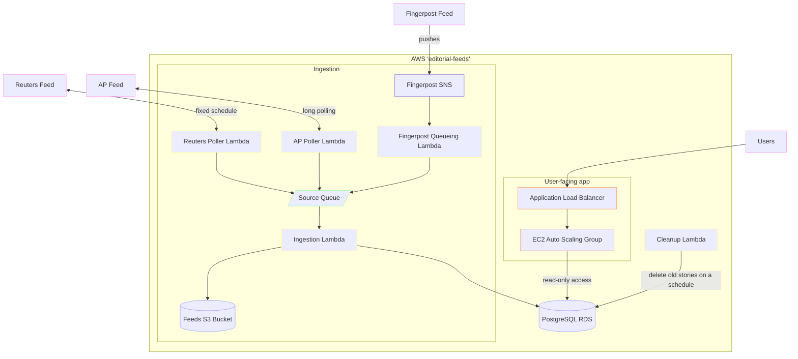

<sup>Looking for the repository containing the current Fingerpost wires? Try [editorial-wires](https://github.com/guardian/editorial-wires) instead (Guardian employees only, sorry!)</sup>

# Newswires

For more details, see

- [`poller-lambdas` README](poller-lambdas/README.md)

## Running locally

Before running any of the projects locally, run the setup script to check dependencies and configure the local environment:

```sh
./scripts/setup
```

### Newswires (API and UI)

This can either be run against the CODE database, or against a local database (requires Docker). Both options currently require
having AWS credentials configured, to allows for fetching [pan-domain-auth](https://github.com/guardian/pan-domain-authentication)
keys and -- when run with the `--use-CODE` flag -- tunnelling to the CODE database.

```sh
# Running against the CODE db
./scripts/start --use-CODE
```

```sh
# Running against a local db (requires Docker)
./scripts/start
```

### Finger post queueing lambda
```sh
docker compose up
npm run dev -w fingerpost-queueing-lambda
```

### Ingestion Lambda

```sh
docker compose up
npm run dev -w ingestion-lambda
```

### Poller Lambdas

```sh
npm run dev -w poller-lambdas
```

...and follow the interactive prompts for running different poller lambdas logic (including simulating the self-queuing mechanism).

## Adding a new poller lambda

See [poller-lambdas/README.md](poller-lambdas/README.md)

## Architecture overview


