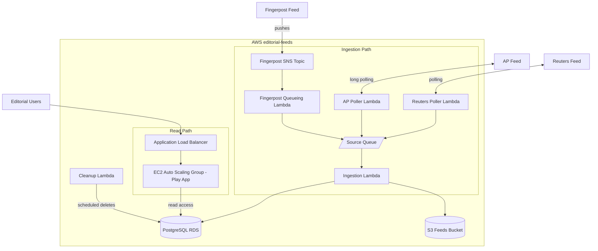

# Newswires

Newswires is The Guardian's editorial wires platform. It ingests agency content (including Reuters, AP, and Fingerpost), stores and enriches it, and serves a searchable feed to editorial users through a Guardian-owned backend and UI.

<sup>Looking for the repository containing the current Fingerpost wires app? Try [editorial-wires](https://github.com/guardian/editorial-wires) instead (Guardian employees only).</sup>

## Contents

- [Introduction](#1-introduction)
- [Getting Started](#2-getting-started)
- [How It Works](#3-how-it-works)
- [Useful Links](#4-useful-links)
- [Terminology](#5-terminology)

## 1. Introduction

Newswires exists to give editorial teams a modern, Guardian-controlled wires experience, while still benefiting from third-party feed integrations.

Primary users are:

- Editorial staff monitoring incoming agency stories
- Product and engineering teams maintaining ingestion, search, and UI behavior
- Operations teams responsible for reliability and deployability

Core capabilities include:

- Ingesting news-wire content from multiple suppliers
- Enriching and validating incoming records
- Persisting content in PostgreSQL for filtering and search
- Archiving raw payloads in S3 for audit and troubleshooting
- Serving content via a Play backend and web UI

External services and suppliers include:

- Fingerpost feed integration (via SNS)
- Reuters and AP feed integrations (via poller lambdas)
- AWS managed services (Lambda, SQS, SNS, S3, RDS, EC2/ALB)

## 2. Getting Started

### Prerequisites

The local environment checks in `scripts/check-requirements` expect:

- Java 17+ with `JAVA_HOME` set
- `sbt`
- Node `v22.15.0` (from `.nvmrc`) and `npm`
- Docker
- nginx and dev-nginx
- AWS CLI with an `editorial-feeds` profile
- scala-cli

You will also need appropriate AWS credentials (Janus/editorial-feeds access) for workflows that read secure config, use tunnels, or access cloud resources.

### First-Time Setup

Run setup from the repository root:

```sh
./scripts/setup --no-overwrite
```

Use `--overwrite` if you explicitly want to replace existing values in `~/.gu/newswires.conf`.

Setup performs the following:

- Checks required tooling and Node version
- Configures local nginx mapping for the app
- Ensures `~/.gu/newswires.conf` has required keys
- Installs npm dependencies

### Run the Main App

Run against local Docker Postgres:

```sh
./scripts/start
```

Run against CODE RDS (via tunnel):

```sh
./scripts/start --use-CODE
```

Both modes require valid AWS credentials.

### Run Components Independently

Fingerpost queueing lambda:

```sh
docker compose up -d
npm run dev -w fingerpost-queueing-lambda
```

Ingestion lambda:

```sh
./scripts/setup-local-db.sh
npm run dev -w ingestion-lambda
```

Poller lambdas (interactive local runner):

```sh
npm run dev -w poller-lambdas
```

Recomputation lambda:

```sh
./scripts/setup-local-db.sh
npm run dev -w recomputation-lambda
```

### Database and Migrations

Start local DB and apply pending migrations:

```sh
./scripts/setup-local-db.sh
```

Useful migration commands:

```sh
./db/flyway.sc info local
./db/flyway.sc migrate local
```

Equivalent targets exist for `test`, `code`, and `prod` (with appropriate connectivity).

### Test, Lint, Typecheck, Build

At repo root:

```sh
npm run lint
npm run typecheck
npm run test
npm run build
```

CI-style workspace commands are also available:

```sh
npm run lint:ci
npm run typecheck:ci
npm run test:ci
npm run build:ci
```

### Deploy and Infrastructure

- CDK stacks are in `cdk/`
- `cdk` synth output generates deployment artifacts and Riff-Raff config
- CI builds all lambdas, the Play app package, and uploads to Riff-Raff

## 3. How It Works

### Core Technologies

- Play Framework (Scala) backend application
- React + Vite client app (served from the Play project)
- TypeScript AWS Lambda services for ingestion, polling, and background tasks
- PostgreSQL with Flyway migrations
- AWS CDK for infrastructure as code
- npm workspaces + Lage for monorepo task orchestration

### High-Level Architecture


```mermaid
graph TB
       Reuters[Reuters Feed]
       AP[AP Feed]
       Fingerpost[Fingerpost Feed]
       Users[Editorial Users]

       subgraph AWS["AWS editorial-feeds"]
              subgraph IngestionPath[Ingestion Path]
                     ReutersPoller[Reuters Poller Lambda]
                     APPoller[AP Poller Lambda]
                     FingerpostSNS[Fingerpost SNS Topic]
                     FingerpostQueueing[Fingerpost Queueing Lambda]
                     SourceQ[/Source Queue/]
                     Ingestion[Ingestion Lambda]

                     ReutersPoller --> SourceQ
                     APPoller --> SourceQ
                     FingerpostSNS --> FingerpostQueueing
                     FingerpostQueueing --> SourceQ
                     SourceQ --> Ingestion
              end

              subgraph ReadPath[Read Path]
                     ALB[Application Load Balancer]
                     ASG[EC2 Auto Scaling Group - Play App]
                     ALB --> ASG
              end

              DB[(PostgreSQL RDS)]
              FeedsBucket[(S3 Feeds Bucket)]
              Cleanup[Cleanup Lambda]

              Ingestion --> DB
              Ingestion --> FeedsBucket
              ASG -- read access --> DB
              Cleanup -- scheduled deletes --> DB
       end

       Reuters <-- polling --> ReutersPoller
       AP <-- long polling --> APPoller
       Fingerpost -- pushes --> FingerpostSNS
       Users --> ALB
```

### Subprojects

- `newswires/`: Play backend and app packaging
- `newswires/client`: React/Vite frontend
- `ingestion-lambda/`: critical-path content processing + persistence
- `poller-lambdas/`: supplier pollers + self-queueing mechanisms
- `fingerpost-queueing-lambda/`: bridges Fingerpost SNS messages into ingestion queueing
- `cleanup-lambda/`: scheduled deletion of old records
- `recomputation-lambda/`: one-off/operational recomputation utility
- `email-filter-lambda/`: email filtering workflow support
- `shared/`: shared TS code/config used across lambdas and CDK
- `cdk/`: AWS infrastructure definitions and synthesis
- `db/`: migration scripts and database helper tooling
- `docs/`: architecture decision records and project documentation

### Key Design Concepts

- Ingestion is latency-sensitive: it is on the critical path for content availability.
- Pollers are supplier-specific and can be fixed-frequency or long-polling.
- The service decouples from third-party UI by persisting data in first-party storage.
- Infrastructure for poller lambdas is generated from shared config to reduce drift.
- Monorepo structure allows coordinated type/lint/test/build workflows across services.

### Things That Might Surprise New Engineers

- `scripts/setup` requires either `--overwrite` or `--no-overwrite`.
- Local app startup still needs AWS credentials for secure config and related integrations.
- `scripts/start --use-CODE` and local Docker DB both expect access to port `5432`.
- Pollers run from an interactive local harness rather than a single non-interactive command.

## 4. Useful Links

- [Previous project README notes](old-README.md)
- [Architecture and project docs](docs/README.md)
- [ADRs index](docs/adrs)
- [Poller lambdas documentation](poller-lambdas/README.md)
- [Database migrations and DB access notes](db/README.md)
- [Ingestion lambda documentation](ingestion-lambda/README.md)
- [CDK infrastructure directory](cdk/README.md)
- [Fingerpost queueing lambda notes](fingerpost-queueing-lambda/README.md)
- [Guardian editorial-wires repository (related)](https://github.com/guardian/editorial-wires)
- [Flyway documentation](https://documentation.red-gate.com/flyway/flyway-cli-and-api/welcome-to-flyway)
- [ssm-scala (RDS tunnelling)](https://github.com/guardian/ssm-scala)

## 5. Terminology

- **Wires**: Continuous feeds of agency content used by editorial teams.
- **Supplier**: External content provider (for example Reuters, AP, Fingerpost).
- **Poller Lambda**: Supplier-specific lambda that fetches content on a schedule or by long-polling.
- **Fingerpost Queueing Lambda**: Lambda that consumes Fingerpost SNS events and enqueues messages for ingestion.
- **Source Queue**: SQS queue consumed by the ingestion lambda as a common intake path.
- **Ingestion Lambda**: Lambda that validates, enriches, archives, and writes content to the Newswires database.
- **Cleanup Lambda**: Scheduled lambda that removes old records from the database.
- **Recomputation Lambda**: Operational lambda used for one-off backfills/recomputations.
- **CODE**: Guardian pre-production environment used for integration testing and validation.
- **PROD**: Production environment.
- **Riff-Raff**: Guardian deployment system used to promote built artifacts.
- **Pan-domain auth**: Guardian authentication/session mechanism used by the app.
