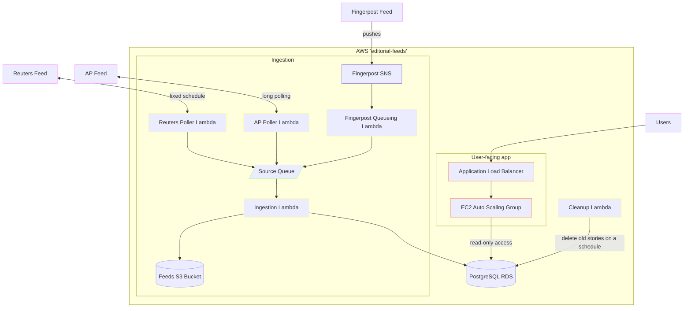

# Newswires

Newswires is The Guardian's editorial wires platform. It ingests and stores agency content, and serves a searchable feed to users.

<sup>Looking for the repository containing the current Fingerpost wires? Try [editorial-wires](https://github.com/guardian/editorial-wires) instead (Guardian employees only, sorry).</sup>

## Contents

1. [Introduction](#1-introduction)
2. [Getting Started](#2-getting-started)
3. [How It Works](#3-how-it-works)
4. [Useful Links](#4-useful-links)
5. [Terminology](#5-terminology)

## 1. Introduction

Newswires is used by Guardian journalists to access incoming agency stories.

Core capabilities include:

- Ingesting wire content from multiple suppliers
- Enriching and validating incoming records
- Persisting content in PostgreSQL for filtering and search
- Archiving raw payloads in S3 for audit and troubleshooting
- Serving content via a Play backend and web UI

External services and suppliers include:

- Fingerpost feed integration (via SNS)
- Reuters and AP feed integrations (via poller lambdas)
- AWS managed services (Lambda, SQS, SNS, S3, RDS, EC2/ALB)

## 2. Getting started

### Prerequisites

The local environment checks in `scripts/check-requirements` expect:

- Java (see [.tool-versions](./.tool-versions)) with `JAVA_HOME` set
- sbt
- Node (see [.nvmrc](./.nvmrc))
- Docker
- nginx and dev-nginx
- scala-cli

You will also need editorial feeds [Janus](https://janus.gutools.co.uk/credentials) credentials.

### First-time setup

Run setup from the repository root to install dependencies and configure the local environment:

```sh
./scripts/setup --no-overwrite
```

Use `--overwrite` if you explicitly want to replace existing config.

### Run the main app

Run against local database (requires Docker):

```sh
./scripts/start
```

Run against CODE database:

```sh
./scripts/start --use-CODE
```

Both options require valid Janus credentials and expect access to port `5432`.

### Run components independently

Fingerpost queueing lambda:

```sh
docker compose up -d
npm run dev -w fingerpost-queueing-lambda
```

Ingestion lambda:

```sh
./scripts/setup-local-db.sh
npm run dev -w ingestion-lambda
```

Poller lambdas (interactive local runner):

```sh
npm run dev -w poller-lambdas
```

Recomputation lambda:

```sh
./scripts/setup-local-db.sh
npm run dev -w recomputation-lambda
```

### Database and migrations

Start local DB and apply pending migrations:

```sh
./scripts/setup-local-db.sh
```

See [db/README.md](./db/README.md) for more commands.

### Test, lint, typecheck, build

At repo root:

```sh
npm run lint
npm run typecheck
npm run test
npm run build
```

CI-style workspace commands can also be run by appending `:ci` to any of the above commands.

### Deploy and infrastructure

- CDK stacks are in `cdk/`
- `cdk` synth output generates deployment artifacts and Riff-Raff config
- CI builds all lambdas, the Play app package and uploads to Riff-Raff

## 3. How it works

### Core technologies

- Play Framework (Scala) backend application
- React + Vite client app (served from the Play project)
- TypeScript AWS Lambda services for ingestion, polling and background tasks
- PostgreSQL with Flyway migrations
- AWS CDK for infrastructure as code
- npm workspaces + Lage for monorepo task orchestration

### High-level architecture


```mermaid
graph TB
    %% External Sources
    Reuters[Reuters Feed]
    AP[AP Feed]
    Fingerpost[Fingerpost Feed]
    Users[Users]

    subgraph AWS["AWS 'editorial-feeds'"]
        subgraph WritePath["Ingestion"]
            %% Lambda Functions for ingestion
            ReutersPoller[Reuters Poller Lambda]
            APPoller[AP Poller Lambda]
            Ingestion[Ingestion Lambda]

            %% Queues and Topics
            FingerpostSNS[Fingerpost SNS]
            FingerpostQueueingLambda[Fingerpost Queueing Lambda]
            SourceQ[/Source Queue/]

            %% Ingestion flows
            ReutersPoller --> SourceQ
            APPoller --> SourceQ
            FingerpostQueueingLambda --> SourceQ
            SourceQ --> Ingestion
            Ingestion --> FeedsBucket
        end

        subgraph ReadPath["User-facing app"]
            %% Web Application
            ASG[EC2 Auto Scaling Group]
            ALB[Application Load Balancer]

            %% Read path flows
            ALB --> ASG
        end

        %% Shared Resources
        FeedsBucket[(Feeds S3 Bucket)]
        DB[(PostgreSQL RDS)]
        Cleanup[Cleanup Lambda]

        %% Shared Resource Flows
        Ingestion --> DB
        ASG -- "read-only access" --> DB
        Cleanup -- "delete old stories on a schedule" --> DB
    end

    %% External Data Flows
    Reuters <-- "fixed schedule" --> ReutersPoller
    AP <-- "long polling" --> APPoller
    Fingerpost -- pushes --> FingerpostSNS
    FingerpostSNS --> FingerpostQueueingLambda
    Users --> ALB

    %% Styling
    classDef external stroke:#f9f
    classDef lambda stroke:#ff9
    classDef queue stroke:#9f9
    classDef storage stroke:#99f
    classDef compute stroke:#f96

    class Reuters,AP,Fingerpost,Users external
    class ReutersPoller,APPoller,Ingestion,Cleanup,FingerpostQueueingLambda lambda
    class SourceQ queue
    class FeedsBucket,DB storage
    class ASG,ALB compute
```

### Key subprojects

- [newswires](./newswires): Play backend and app packaging
- [newswires/client](./newswires/client): React/Vite frontend, see [newswires/client/README.md](./newswires/client/README.md)
- [ingestion-lambda](./ingestion-lambda): critical-path content processing + persistence, see [ingestion-lambda/README.md](ingestion-lambda/README.md)
- [poller-lambdas](./poller-lambdas): supplier pollers + self-queueing mechanisms, see [poller-lambdas/README.md](poller-lambdas/README.md)
- [fingerpost-queueing-lambda](./fingerpost-queueing-lambda): bridges Fingerpost SNS messages into ingestion queueing, see [fingerpost-queueing-lambda/README.md](fingerpost-queueing-lambda/README.md)
- [cleanup-lambda](./cleanup-lambda): scheduled deletion of old records
- [recomputation-lambda](./recomputation-lambda): one-off/operational recomputation utility, see [recomputation-lambda/README.md](./recomputation-lambda/README.md)
- [db](./db): migration scripts and database helper tooling, see [db/README.md](db/README.md)

### Key design concepts

- Ingestion is latency-sensitive: it is on the critical path for content availability.
- Pollers are supplier-specific and can be fixed-frequency or long-polling.
- Infrastructure for poller lambdas is generated from shared config to reduce drift.
- Monorepo structure allows coordinated type/lint/test/build workflows across services.

## 4. Useful links

- [Architecture and project docs](docs/README.md)
- [CDK infrastructure directory](cdk/README.md)
- [Flyway documentation](https://documentation.red-gate.com/flyway)
- [ssm-scala (RDS tunnelling)](https://github.com/guardian/ssm-scala)

## 5. Terminology

- **Poller Lambda**: Supplier-specific lambda that fetches content on a schedule or by long-polling.
- **Fingerpost Queueing Lambda**: Lambda that consumes Fingerpost SNS events and enqueues messages for ingestion.
- **Source Queue**: SQS queue consumed by the ingestion lambda as a common intake path.
- **Riff-Raff**: Deployment tool.
- **Pan-domain auth**: Authentication/session mechanism used by the app.
