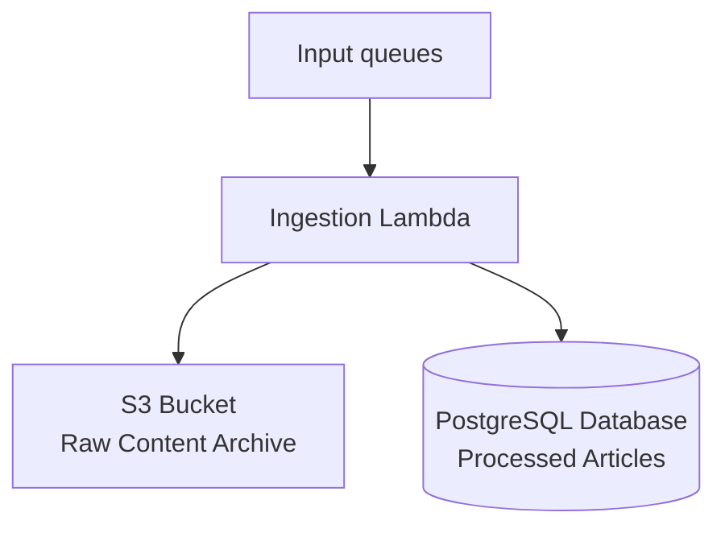

# Ingestion Lambda

A serverless AWS Lambda function that processes news wire content from various feeds (Reuters, AP, Fingerpost, etc.) and stores them in a PostgreSQL database for the Newswires application.

## What it does

The ingestion lambda receives messages from SQS queues containing news wire content, processes and enriches the content, then stores it in a database. Key responsibilities include:

- **Content Processing**: Parses JSON payloads from various news wire suppliers
- **Data Enrichment**: Adds category codes, geographical regions, and supplier information
- **Text Cleaning**: Processes body text markup and handles encoding issues
- **Database Storage**: Saves processed articles to PostgreSQL with deduplication
- **S3 Archival**: Stores raw content in S3 for backup and audit purposes

It's important to note that this Lambda is on the critical path for new content to get into the Newswires app. As a result, we need to be mindful of tradeoffs in this function between processing the data and delivering the content quickly.

## Architecture

The lambda is triggered by SQS events from two main sources:

- **Source Queue**: Messages from poller lambdas (Reuters, AP)
- **Fingerpost Queue**: Direct messages from Fingerpost feeds



## Running locally

```bash
docker compose up

npm run dev
```
